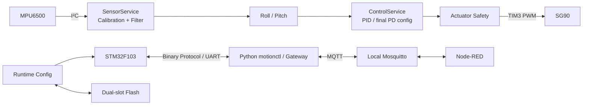
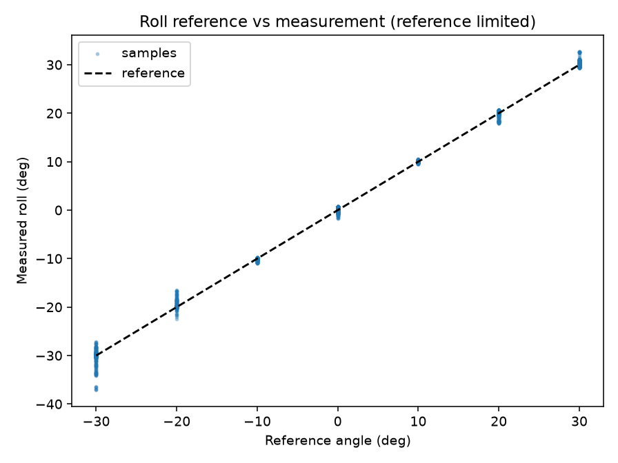
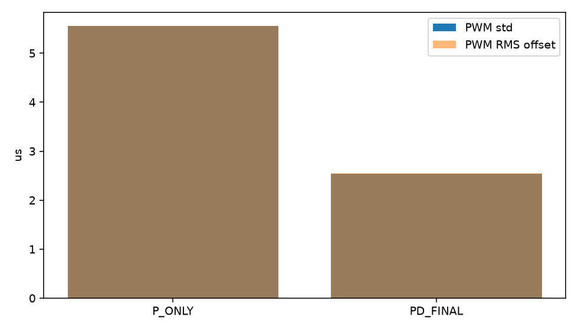

# MotionEdge-F103

## 基于 STM32 的姿态感知与物联网控制平台

MotionEdge-F103 基于 STM32F103C8T6 与 MPU6500，在 MCU 本地完成 100 Hz 姿态融合和 PID 控制计算，并通过 Python Gateway、MQTT 与 Node-RED 实现设备诊断、运行时配置和实时监控。当前正式固件、motionctl 与 Gateway 版本均为 `1.0.1`。

> 控制链定义：姿态感知 → PID 控制计算 → 舵机输出。SG90 不会带动 MPU6500，因此这是 `PID-based attitude-driven servo control`，不是外部机械姿态反馈闭环或自平衡系统。

## 核心功能

- MPU6500 六轴采集、500 样本静态校准、低通与互补滤波，输出 Roll/Pitch。
- FreeRTOS 四任务调度；SensorTask 同步执行采样、姿态估计和 100 Hz 控制，不额外创建 ControlTask。
- 完整 PID 模块，最终采用 `Kp=1.0, Ki=0, Kd=0.05` 的 PD 配置；支持轴、方向、零位、死区、D 项滤波与输出限幅。
- SG90 显式 Arm、单一 Owner、命令超时、ESTOP、故障安全和 1450–1550 µs 绝对 PWM 窗口。
- CRC16 二进制串口协议、Python `motionctl`、本地 Mosquitto Gateway 和 Node-RED 波形/配置界面。
- 双槽 Flash 配置持久化：CRC、generation、commit marker、Factory Reset 和安全启动。
- Host C/Python 测试、Debug/Release 构建、资源门禁、GitHub Actions 与可复现 Release。

## 系统架构



完整分层、实时数据流、IoT 和 RTOS 图见 [`docs/architecture.md`](docs/architecture.md)。

## 实机与演示

仓库当前没有可确认来源的整机照片，因此不使用生成图片冒充实物。建议 README 实机主图拍摄同一画面中的 STM32F103 最小系统板、MPU6500、SG90、ST-LINK、CH340、舵机独立 5 V 电源及共地接线；拍摄规范见 [`docs/demo/screenshot-plan.md`](docs/demo/screenshot-plan.md)。

| 姿态参考比较* | P / PD PWM 输出比较 |
|---|---|
|  |  |

现场 5 分钟流程见 [`docs/demo/demo-script.md`](docs/demo/demo-script.md)，故障恢复见 [`docs/demo/demo-recovery.md`](docs/demo/demo-recovery.md)。

## 核心指标

| 指标 | 结果 |
|---|---:|
| Attitude + Control | 100 Hz |
| Roll MAE* | 0.352° |
| Pitch MAE* | 0.375° |
| PWM output std reduction | 54.4%（5.555 → 2.535 µs） |
| Hardware validation | 600 s+ |
| Stable MQTT Motion | 4934 / 4934 |
| Gateway → Node-RED local P95 | 2 ms |
| v1.0.1 Debug Flash | 59240 B，节省 3068 B |

\* `REFERENCE_LIMITED`：参考为 iPhone 内置水平仪且测量不确定度未知；MAE 是相对该参考的工程比较，不是绝对传感器精度。全部指标和证据见 [`PROJECT_METRICS`](docs/PROJECT_METRICS.md)。

## 技术栈

| 层 | 技术 |
|---|---|
| Hardware | STM32F103C8T6、MPU6500、SG90、ST-LINK、CH340 |
| Firmware | C11、STM32 HAL、FreeRTOS CMSIS-RTOS2、CMake、Arm GNU Toolchain 14.2.Rel1 |
| Algorithms | 静态零偏校准、低通滤波、互补姿态融合、PID/PD |
| Protocol | Binary Protocol v1、CRC16-CCITT-FALSE、USART1 |
| Host / IoT | Python、pyserial、Paho MQTT、Mosquitto、Node-RED |
| Engineering | Host C/Python tests、GitHub Actions、size/overlap gate、versioned release |

## 快速运行

硬件接线：MPU6500 I²C 接 PB6/PB7，CH340 接 USART1 PA9/PA10，SG90 信号接 PA6；所有设备共地，SG90 使用独立稳压 5 V。

```powershell
python -m pip install -e .\host
python -m motionctl ports
python -m motionctl doctor --port COM4 --baud 115200
python -m motionctl monitor --port COM4 --duration 30
```

启动本地 IoT 链路：

```powershell
powershell -ExecutionPolicy Bypass -File tools/start-phase07-broker.ps1
powershell -ExecutionPolicy Bypass -File tools/start-phase07-node-red.ps1
python -m motionctl gateway run --config config/motionedge-gateway.toml
```

详细步骤见 [`docs/quick-start-v1.0.md`](docs/quick-start-v1.0.md) 和 [`motionctl CLI`](docs/motionctl-cli-reference.md)。

## 安全边界

- 上电不恢复 Arm、Owner 或 PID Enable；默认 Control Disabled、Actuator Disarmed、Owner NONE、PWM 1500 µs。
- 舵机绝对窗口 1450 / 1500 / 1550 µs，PID 输出限制为 ±10 µs；不得为演示扩大。
- Arm 前确认舵机无负载、无遮挡、ESTOP 可触达，并使用独立 5 V 电源和共地。
- 传感器离线、姿态过期、App Fault、执行器故障和 ESTOP 都会进入安全状态。
- MQTT 是本地原型，无 TLS；不得直接暴露公网。实时控制留在 STM32，Broker/Gateway 掉线不接管 PID。

## 工程结构

```text
App/RTOS/          应用装配与四个静态 FreeRTOS 任务
Services/          传感、运动、控制、执行器、通信、配置服务
Algorithms/        低通、姿态估计、PID（无 HAL 依赖）
Devices/ + BSP/    MPU6500 与 HAL 外设适配
Middleware/        帧协议、解析器、CRC、环形缓冲、日志
host/motionctl/     Python CLI、采集、报告、MQTT Gateway
node-red/           本地监控与配置 Flow
Tests/Host/         Firmware 主机 C 测试
host/tests/         Python 测试
artifacts/          历史实机与发布证据
docs/               设计、展示、复试与证据索引
```

推荐代码阅读路线见 [`docs/code-tour.md`](docs/code-tour.md)。

## Validation

| Area | Result |
|---|---|
| Attitude sampling | 100 Hz |
| Roll/Pitch MAE | 0.352° / 0.375°* |
| RTOS soak | PASS |
| MQTT stable messages | 4934 / 4934 |
| Local P95 | 2 ms |
| PID output std | 5.555 → 2.535 µs（54.4%） |
| Power-cycle persistence | PASS |
| CI | PASS |
| v1.0.1 smoke | PASS |

验证入口：[`EVIDENCE_INDEX`](docs/EVIDENCE_INDEX.md)；完整技术报告：[`MotionEdge-F103-technical-report.md`](docs/MotionEdge-F103-technical-report.md)。

## Release

- 当前版本：[`v1.0.1`](https://github.com/cool555alan-ui/MotionEdge-F103/releases/tag/v1.0.1)
- Firmware / motionctl / Gateway：`1.0.1`
- Config Schema：`1`
- Debug：Flash 59240 / 63488 B；RAM 17824 / 18944 B
- Release：Flash 54296 / 63488 B；RAM 17824 / 18944 B

## Limitations

- 单 MPU6500 手持输入；没有舵机输出到传感器姿态的机械外环。
- 六轴 IMU 无磁力计，未提供可长期约束的绝对 Yaw。
- Phase 8 手机水平仪参考为 `REFERENCE_LIMITED`。
- PWM 电气抖动 `NOT_TESTED`；Servo 电流遥测 `NOT_AVAILABLE`。
- 本地 MQTT 无 TLS；600 s/1800 s 结果不是工业寿命或长期可靠性声明。
- STM32F103C8 资源有限；v1.0.1 RAM 余量 1120 B。

术语边界和后续方向见 [`docs/TERMINOLOGY.md`](docs/TERMINOLOGY.md) 与 [`docs/interview/limitations.md`](docs/interview/limitations.md)。
