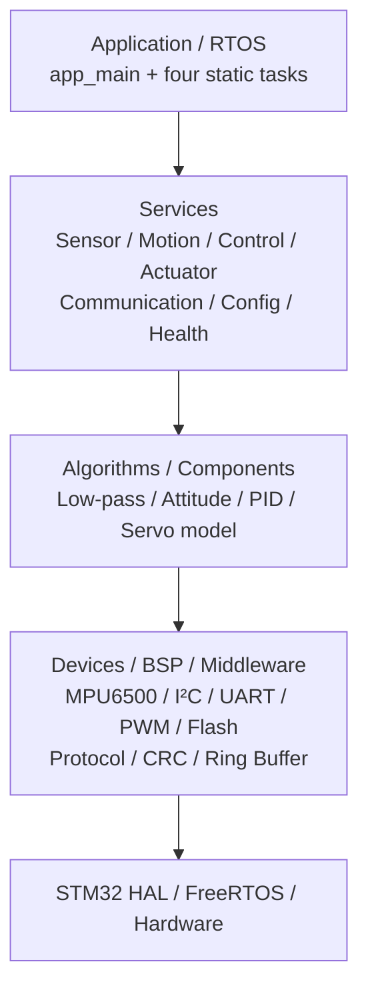
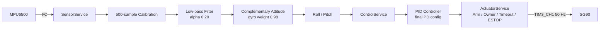
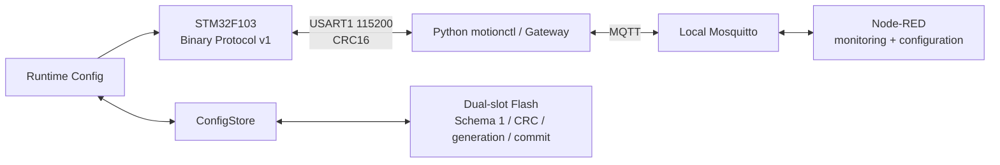
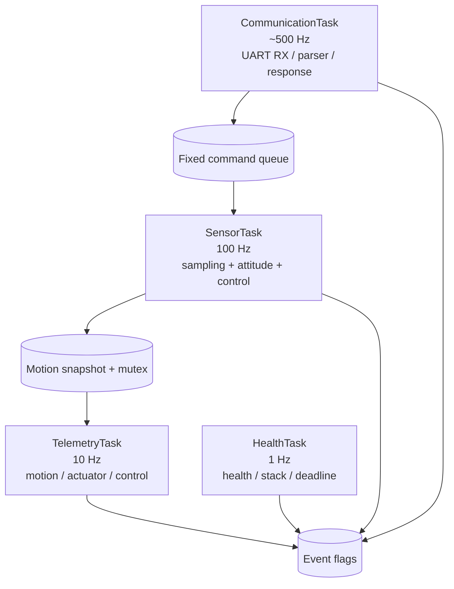
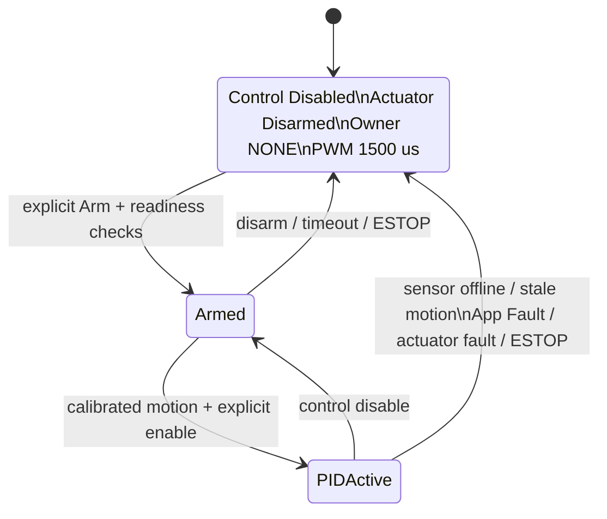

# MotionEdge-F103 架构

本页描述 v1.0.1 的实际结构。CubeMX 生成外设初始化，用户代码按 BSP/Device、Algorithm、Service、Application/RTOS 分层；实时控制完全留在 MCU，Python/MQTT 只负责配置、观测和诊断。

## 1. Firmware Layers

分层原则：HAL 调用留在 BSP/驱动适配层；算法不依赖 STM32 HAL；Service 表达业务状态机与安全语义；RTOS 层只负责装配、调度和跨任务对象。

## 2. Realtime Data Flow

这条链是“姿态感知 → PID 控制计算 → 执行器输出”。MPU6500 由用户手持，SG90 不带动传感器，因此没有从舵机输出返回到 MPU6500 的机械反馈边；不能据此声称自平衡或外部机械姿态闭环。

## 3. IoT and Persistence

MQTT 中断不会停止 100 Hz 本地 PID。命令使用非 retained、安全白名单、过期检查和 `request_id` 去重；本地 Broker 原型无 TLS，不面向公网部署。

## 4. RTOS Tasks

没有额外 ControlTask。PID 紧跟 SensorTask 的新姿态样本执行，从而减少一次任务切换和一份任务栈，避免采样与控制相位分离。CommunicationTask 以约 2 ms 周期服务串口；TelemetryTask 将内部 100 Hz 状态降采样到 10 Hz；HealthTask 低频汇总运行状态。

## 5. Safety State Flow

运行时可配置项可以持久化，但 Arm、Owner 和 PID Enable 永不持久化。双槽 Flash 只恢复安全配置；重启始终回到安全状态。

## 6. 关键代码位置

- 任务装配：`App/RTOS/rtos_tasks.c`、`rtos_objects.c`。
- 采集与姿态：`Services/sensor_service.c`、`motion_service.c`、`Algorithms/attitude_estimator.c`。
- 控制与安全：`Algorithms/pid_controller.c`、`Services/control_service.c`、`actuator_service.c`。
- 协议：`Middleware/protocol_frame.c`、`protocol_parser.c`、`Services/command_service.c`。
- 持久化：`Services/config_store.c`、`config_persistence.c`、`BSP/bsp_flash.c`。
- Host/IoT：`host/motionctl/device.py`、`gateway.py`、`mqtt_topics.py`。

进一步阅读见 [`code-tour.md`](code-tour.md)；所有实测数字见 [`PROJECT_METRICS.md`](PROJECT_METRICS.md)。
