# MotionEdge-F103 项目演进

```mermaid
flowchart LR
    A[Firmware Foundation] --> B[MPU6500]
    B --> C[Calibration + Attitude]
    C --> D[Binary Protocol]
    D --> E[FreeRTOS]
    E --> F[Python Tools]
    F --> G[MQTT + Node-RED]
    G --> H[Attitude Characterization]
    H --> I[Safe Actuator]
    I --> J[PID Attitude-driven Control]
    J --> K[Dual-slot Persistence]
    K --> L[CI + v1.0 Release]
    L --> M[v1.0.1 Resource Optimization]
```

| 里程碑 | 解决的问题 | 可追溯版本 |
|---|---|---|
| Firmware | 建立板级启动、日志、状态与 Host C 测试 | `2f12196` |
| MPU6500 | 打通 I²C 扫描、身份识别与六轴读取 | `dc683ed` |
| Attitude | 加入 500 样本校准、低通、互补融合和 Roll/Pitch | `f90f27c` |
| Protocol | 固定帧、CRC16、解析恢复和运行时命令 | `3dd5d5d` |
| FreeRTOS | 四任务、固定资源、deadline/stack/heap 观测 | `v0.5-freertos-validated` |
| Python Tools | `motionctl` 诊断、采集、验证、报告 | `v0.6-device-tools-validated` |
| IoT | 本地 Gateway、MQTT 契约、Node-RED | `v0.7-iot-gateway-validated` |
| Characterization | 噪声、漂移、参考比较和参数筛选 | `v0.8-attitude-characterized` |
| Actuator | Arm/Owner/Timeout/ESTOP/PWM 安全窗口 | `v0.9-actuator-validated` |
| PID | 100 Hz 姿态驱动控制、最终 PD 配置 | `v0.9.1-pid-attitude-validated` |
| Persistence | 双槽 Flash、真实掉电、Factory Reset、安全启动 | `v1.0.0` |
| Resource | Debug HAL/FreeRTOS 使用 `-Os`，应用保持 `-Og -g3` | `v1.0.1` |

v1.0.1 后项目主体功能冻结。后续优先方向不是继续堆功能，而是：建立带反馈的单轴机械平台；加入编码器或第二 IMU；在功能扩展前评估更高资源 MCU；公网部署前设计 TLS、认证和 ACL。
